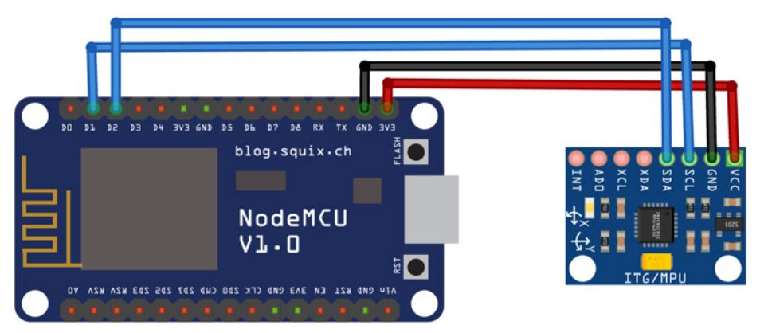

# Wheelchair_Fall_Detection_System-IOT
we have build a fall detection device using NodeMCU and MPU6050 sensor module. MPU6050 sensor module features a gyroscope and an accelerometer. The gyroscope is used to determine the orientation and the accelerometer provides information about the angular parameter such as the three-axis data. To detect the fall, we will compare the acceleration magnitude with the threshold value. If the fall is detected, the device will send an SMS to the concerned person. NodeMCU is used here as a microcontroller and Wi-Fi module to connect with IFTTT to send SMS.

 

## Components Required 

 • NodeMCU ESP8266
 
 • MPU6050 Accelerometer
 
 • Buzzer
 
 • Connecting Wires
 
 
## Circuit Diagram
Circuit Diagram for IoT based Fall Detector using NodeMCU is given below.

|  | 
|:--:| 
| **Circuit Diagram:**NodeMCU ESP8266 with MPU6050 Accelerometer** |

